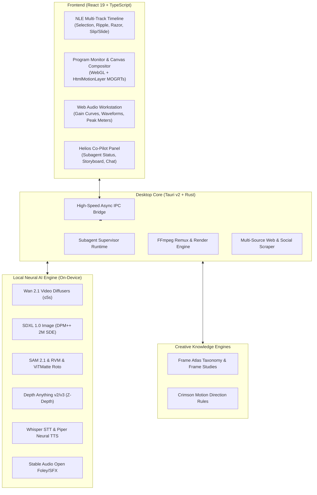

# ☀️ Helios

> **The World’s First Truly AI-Native Non-Linear Video Editor (NLE)**  
> *Professional human editing meets autonomous AI co-pilots, local neural generation, and the Frame Atlas cinematic taxonomy.*

[](https://www.rust-lang.org/)
[](https://tauri.app/)
[](https://react.dev/)
[](https://www.typescriptlang.org/)
[](https://vitejs.dev/)
[](https://ffmpeg.org/)
[](https://opensource.org/licenses/MIT)

---

## 📖 Overview

**Helios** is a next-generation desktop video editing suite engineered to unite **industry-standard Premiere Pro-style NLE precision** with **cutting-edge on-device neural AI models** and **autonomous co-pilot agents**.

Traditional NLEs (Premiere Pro, DaVinci Resolve, Final Cut) were architected decades ago around manual clip dragging and clunky proprietary plugins, locking creators into expensive SaaS subscriptions while offering bolted-on cloud AI that uploads private footage to third-party servers. Conversely, code-only renderers (Remotion, HyperFrames) lack a tactile, interactive visual workspace for creators, while cloud video tools (CapCut, Runway, Descript, InVideo) trap users behind credit meters, queue waits, and watermark paywalls.

**Helios bridges every divide**:
- **For Editors & Creators**: A zero-lag, 60 FPS multi-track NLE with magnetic snapping, ripple & rolling edits, razor slicing, rate stretch, slip & slide, bezier keyframing, real-time Web Audio waveforms, and hardware-accelerated color grading.
- **For Autonomous AI Agents**: A fully programmable desktop workspace where agents (Claude Code, Codex, Gemini, Antigravity, OpenCode) can perform deep online research, scrape multi-source social videos via `yt-dlp`, synthesize local neural video (Wan 2.1) and voice-overs (Piper), apply Frame Atlas cinematic styling, and build complete broadcast-ready timelines autonomously.
- **100% Private & Local-First**: Runs on your own machine. Zero cloud fees, zero subscription paywalls, zero telemetry on your footage.

---

## ⚡ Why Helios Outperforms Everything Else

| Capability | Helios ☀️ | Adobe Premiere Pro | DaVinci Resolve Studio | CapCut / Descript | Runway / Pika / Sora Web | Remotion / HyperFrames |
| :--- | :---: | :---: | :---: | :---: | :---: | :---: |
| **Pricing Model** | **Free & Open Source (MIT)** | $359.88/yr subscription | $295 one-time license | $120–$240/yr + credits | Heavy credit paywalls | Free / Open Core |
| **Data Privacy & Local Inference** | **100% On-Device / Offline** | Cloud add-ons upload data | Local Studio engine | Uploads to cloud servers | Uploads everything | Local code, cloud AI |
| **Interactive 60 FPS Desktop NLE** | **✅ Native Tauri + WebGL** | ✅ Industry standard | ✅ Industry standard | 🟡 Simplified / Basic | ❌ None (Web only) | ❌ None (Code only) |
| **Multi-Track Precision Editing** | **✅ Overwrite, Ripple, Roll, Slip, Slide** | ✅ Full tool suite | ✅ Full tool suite | ❌ Basic trimming only | ❌ None | ❌ Code-based only |
| **Autonomous AI Co-Pilot** | **✅ Full Agent Tool Suite & Subagents** | ❌ None (Assistive only) | ❌ None | ❌ None | ❌ None | 🟡 LLM writes code scripts |
| **Zero-to-One ("Make This Video")** | **✅ Script → Voice → Media → Motion** | ❌ Manual workflow | ❌ Manual workflow | 🟡 Template-based | 🟡 Prompt to video clip | ❌ Script to render only |
| **Local Text-to-Video (Wan 2.1)** | **✅ Built-in (Diffusers, ≤5s hero)** | ❌ None | ❌ None | ❌ None | 🟡 Cloud GPU queues | ❌ None |
| **Local Text-to-Image (SDXL 1.0)** | **✅ Optimal buckets, DPMSolver++** | ❌ Firefly (Cloud credits) | ❌ None | 🟡 Cloud generation | 🟡 Cloud generation | ❌ None |
| **Local Rotoscoping (SAM2 / RVM)** | **✅ Instant green-screen-free roto** | 🟡 Roto Brush (Heavy CPU) | ✅ Magic Mask (Studio only) | 🟡 Cloud cutout | 🟡 Cloud brush | ❌ None |
| **Local Offline Voice-Over (Piper TTS)** | **✅ Multilingual / Hinglish on CPU** | ❌ Cloud only | ❌ None | 🟡 Cloud TTS | 🟡 Cloud TTS | ❌ External API only |
| **Multi-Source Video Scraper & yt-dlp** | **✅ Direct URL/embed/OG scraper** | ❌ Manual download needed | ❌ Manual download needed | ❌ None | ❌ None | ❌ None |
| **Frame Atlas Cinematic Taxonomy** | **✅ Built-in visual ontology & refs** | ❌ None | ❌ None | ❌ None | ❌ None | ❌ None |
| **Declarative HTML/CSS/GSAP MOGRTs** | **✅ Live-seekable web code overlays** | 🟡 After Effects comps | 🟡 Fusion macro nodes | ❌ Pre-baked templates | ❌ None | ✅ Web components |
| **Render Queue & Export Presets** | **✅ 4K, 9:16 Reels, ProRes, Twitter** | ✅ Adobe Media Encoder | ✅ Deliver Page | 🟡 Basic exports | 🟡 Cloud rendering | 🟡 Headless CLI |

---

## 🌟 Key Features

### 🎬 1. Premiere-Parity Professional NLE Engine
- **Multi-Track Architecture**: Unlimited Video ($V_1 \dots V_n$) and Audio ($A_1 \dots A_n$) tracks with individual track locks, sync locks, target patching, and solo/mute toggles.
- **Precision Edit Toolset**:
  - `V` **Selection Tool**: Non-destructive clip manipulation, drag-and-drop overwrite or insert.
  - `C` **Razor Tool**: Frame-accurate slicing across single tracks or all unlocked tracks.
  - `B` **Ripple Edit** & `N` **Rolling Edit**: Dynamic head/tail trims with automatic timeline gap closure.
  - `R` **Rate Stretch**: Real-time clip speed modification with optional pitch preservation.
  - `Y` **Slip** & `U` **Slide**: Adjust source in/out points while preserving timeline duration and position.
  - `P` **Pen Tool**: Direct bezier rubber-band keyframing on clips for opacity, volume, and masks.
  - `T` **Type Tool**: On-monitor kinetic typography and caption authoring.
- **Nested Compositions**: Full support for multiple sequences, comp tabs, and hierarchical nested comps.
- **Audio Workstation**: Web Audio API engine with real-time waveform display, interactive gain curves, peak meters, and automatic audio ducking under speech (-18 dB).

---

### 🚀 2. The Zero-to-One Autonomous Video Creation Pipeline ("Make This Video")
Tell Helios to *"Make an engaging 30-second documentary on Cyberpunk Architecture"* from an empty project, and watch the co-pilot autonomously drive the entire pipeline:
1. **Frame Atlas Styling Selection**: Queries the Frame Atlas visual taxonomy (`query_frame_atlas`) to establish lighting (volumetric cyan/magenta practicals), composition (leading lines, low angle), and color palette.
2. **Timed Script Generation**: Generates a scene-by-scene script with narration, visual descriptions, and pacing markers.
3. **Local Neural Voice-Over Synthesis**: Uses offline Piper TTS (`synthesize_speech_voiceover`) to synthesize natural narration and automatically drops the audio take onto timeline track $A_1$.
4. **Multi-Source Online Gathering**: Scrapes b-roll videos and reference stills via `scrape_videos` and `download_online_media`, organizing them into clean project bins.
5. **Wan 2.1 Hero Video Generation**: Generates photorealistic cinematic cutaways on local hardware (strictly capped at 5 seconds per clip with rich multi-layered prompt formulation).
6. **Code-as-Video Motion Graphics**: Generates and overlays kinetic HTML/CSS/GSAP titles, callouts, and lower-thirds on track $V_2$.
7. **Pacing & Polish**: Cuts footage to voiceover pauses, adds transitions, and ducks background music.

---

### 🧠 3. On-Device Neural AI Suite (100% Private, Zero Cloud Cost)
All AI models run locally on your GPU/CPU via PyTorch, Diffusers, and ONNX WebAssembly:
- **Wan 2.1 Text-to-Video**:
  - State-of-the-art open video generation model running locally via Diffusers.
  - **Strict 5.0-second maximum cap** (81 frames at 16 fps) prevents runaway GPU memory and ensures crisp, coherent hero moments.
  - **Deep Prompt Formulation**: Automatically structures prompts into *Subject*, *Background*, *Foreground*, *Camera Movement*, *Lighting*, and *Tone*, combined with a master negative prompt against blur, jitter, and distortions.
- **SDXL 1.0 Text-to-Image**:
  - Native 1-megapixel training aspect ratio buckets (16:9, 9:16 vertical reels, 1:1, 21:9 ultrawide).
  - High-precision DPM++ 2M SDE Karras scheduler for maximum detail.
  - Pure chroma green screen mode (`#00FF00`) for seamless subject overlays and icon generation.
- **SAM 2.1 & Robust Video Matting (RVM) & ViTMatte**:
  - Temporal neural rotoscoping directly on timeline clips.
  - Enables **Text-Behind-Subject** typography and green-screen-free subject isolation.
- **Depth Anything (v2/v3)**:
  - High-resolution monocular depth estimation for 3D parallax layers and cinematic depth occlusion planes.
- **Whisper.cpp (STT)**:
  - Ultra-fast on-device speech-to-text with word-level timestamps and kinetic caption generation.
- **Piper Neural TTS**:
  - Offline, high-speed neural voice-over synthesis running directly on the CPU with multilingual and Hinglish support.
- **Stable Audio Open**:
  - On-device sound effect, foley, and ambient background score generation.

---

### 🎨 4. Frame Atlas Cinematic Taxonomy & Reference System
Helios natively integrates the **Frame Atlas Collection Kit** visual ontology:
- **Controlled Cinematic Vocabulary**:
  - **Shot Sizes**: Extreme Wide, Wide, Full, Medium Wide, Medium, Medium Close-Up, Close-Up, Extreme Close-Up, Insert.
  - **Camera Angles**: Eye Level, High, Low, Overhead, Ground Level, Dutch Angle.
  - **Light Patterns**: Silhouette, Rim Light, Volumetric Beams, Practical in Frame, Low-Key, High-Key, Soft Daylight.
  - **Composition**: Symmetry, Centered, Negative Space, Leading Lines, Foreground Layers, Diagonals, Shallow Focus.
  - **Camera Movement**: Static, Pan, Tilt, Dolly, Tracking, Crane, Handheld, Orbital Arc, Zoom.
  - **Color Tones & Moods**: Warm, Cool, Mixed, Neutral, Golden Hour, Blue Hour, Awe, Intimate, Isolated, Tense, Ominous.
- **17 Curated Film Frame Studies**: Embedded reference benchmarks from cinema and animation (e.g. *Scale before the story*, *Small figure. Enormous unknown.*, *Technology between us*, *Let the light feel like relief*).
- **`query_frame_atlas` Tool**: Allows AI agents to query the library, derive harmonious color palettes, and activate project reference guidelines on the fly.

---

### 🌐 5. Advanced Web Scraping & Social Video Ingestion Engine
Never leave the editor to search for b-roll or download reference clips:
- **Multi-Source Scraping Engine in Rust (`web_media.rs`)**:
  - Scrapes HTML5 `<video>` tags and nested `<source>` streams.
  - Parses OpenGraph video tags (`og:video`, `og:video:url`, `og:video:secure_url`) and Twitter player cards.
  - Normalizes iframe embeds from YouTube, Vimeo, TikTok, Dailymotion, Loom, and Streamable into canonical URLs.
  - Extracts JSON-LD `VideoObject` structured metadata and direct media anchor links.
- **Universal Downloader via `yt-dlp`**:
  - Natively downloads from YouTube (Videos & Shorts), Instagram Reels, TikTok, Twitter/X, Reddit (`v.redd.it`), Facebook, Threads, Pinterest, Twitch, Bluesky, Dailymotion, Bilibili, and Streamable.
  - **Smart HTML-to-yt-dlp Fallback**: If a direct link returns `text/html`, the engine catches it and invokes `yt-dlp` instead of saving corrupt files.
- **Precision Downloader Controls**:
  - In-engine time trimming (`startTime`, `endTime`).
  - Spatial aspect ratio cropping (`9:16`, `1:1`, `16:9`).
  - Audio stripping (`noAudio: true`) for instant clean video-only b-roll.
  - Automatic organization into dedicated project asset folders.

---

### 🎭 6. Code-as-Video MOGRT Motion Graphics (HTML/CSS/GSAP)
- **Declarative Web Overlays**: Motion graphics written in standard HTML5, modern CSS (glassmorphism, CSS variables), and GSAP animations via [`HtmlMotionLayer`](file:///d:/Helios/src/editor/HtmlMotionLayer.tsx).
- **Zero-Lag Timeline Scrubbing**: Motion graphics synchronize with the timeline playhead via CSS custom properties (`--time`, `--elapsed`, `--progress`).
- **Designer Template Library**:
  - Kinetic Typography & Hook Titles
  - Glassmorphism Lower-Thirds
  - Animated Metric & Stat Callout Pills
  - Feature Badges & Social Banners
  - Countdown Timers & Progress Bars

---

### 🤖 7. Autonomous Subagents & Parallel Workers
- **Multi-Agent Supervisor**: Spawn dedicated background subagents (`spawn_subagent`, `wait_subagent`, `list_subagents`) to handle long-running tasks.
- **Parallel Workflows**: While you edit on the timeline, subagents can perform web research, download b-roll, synthesize voice-overs, and render neural rotoscopes in parallel.
- **Real-Time UI Status**: The chat status bar displays live agent counts and active background tasks.

---

### 📦 8. Export Presets & Background Render Queue
- **Pre-Configured Export Profiles**:
  - YouTube 4K & 1080p (H.264 / AAC)
  - Vertical Short / Reel / TikTok (9:16 1080×1920 60 FPS)
  - Twitter / X High Quality
  - Apple ProRes 422 Master
  - Instagram Square (1:1 1080×1080)
- **Non-Blocking Background Render Queue**: Queue multiple exports without freezing the editor interface.

---

## 🏗️ Architecture

Helios is engineered as a high-performance hybrid desktop system:



---

## 🚀 Quick Start

### Prerequisites
- **Node.js**: v20.x or v22.x LTS
- **Rust**: 1.85+ (`rustup default stable`)
- **FFmpeg**: Installed and available on your system `PATH`
- **yt-dlp**: Installed and available on your system `PATH` (for social video ingestion)
- **Python**: 3.10+ with PyTorch & CUDA (for local GPU neural models like Wan 2.1 and SDXL)

### Installation

1. **Clone the repository**:
   ```bash
   git clone https://github.com/memegyanfactory-gif/Helios.git
   cd Helios
   ```

2. **Install frontend dependencies**:
   ```bash
   npm install
   ```

3. **Launch in development mode**:
   ```bash
   npm run dev
   ```
   *Starts Vite dev server and launches the Tauri v2 desktop application with Hot Module Reloading.*

4. **Web-only preview mode**:
   ```bash
   npm run dev:web
   ```

---

## 🧪 Testing & Validation

Helios maintains rigorous test suites across both the frontend editing engine and Rust backend:

```bash
# Run all Vitest suites (Timeline, Web Scraping, Frame Atlas, Motion Graphics, Subagents)
npx vitest run

# Run Rust backend tests
cargo test --manifest-path src-tauri/Cargo.toml

# Typecheck TypeScript codebase
npx tsc --noEmit

# Check Rust backend compilation
cargo check --manifest-path src-tauri/Cargo.toml
```

---

## 🗺️ Roadmap

- [x] **Project Multi-Comp Model**: Unlimited tracks, freely placed clips, linked A/V, transition blocks.
- [x] **Core NLE Engine**: Overwrite, insert, ripple delete, slip, slide, rate stretch, razor slicing.
- [x] **On-Device AI Suite**: Wan 2.1 video generation (≤5s), SDXL image gen, SAM2/RVM rotoscoping, Depth Anything v2/v3, Whisper STT, Piper TTS.
- [x] **Frame Atlas Reference Integration**: Controlled cinematic vocabulary, 17 core frame studies, prompt enrichment.
- [x] **Zero-to-One Autonomous Pipeline**: Script → Voiceover → Social Scraping → Wan 2.1 → Motion Graphics → Timeline Assembly.
- [x] **Multi-Source Social Scraper**: HTML5, OpenGraph, Twitter cards, iframe embeds, and `yt-dlp` integration with trimming & cropping.
- [x] **Autonomous Subagent Supervisor**: Parallel background tasks with live status indicators.
- [x] **MOGRT HTML/CSS/GSAP Templates**: Declarative web motion graphics with real-time seeking and nested comp overlays.
- [x] **Export Presets & Render Queue**: YouTube 4K, Reels/TikTok 9:16, ProRes 422, Twitter/X.
- [ ] **Multi-Camera Editing**: Synchronized multi-angle switching and timeline audio phase alignment.
- [ ] **Hardware H.265 / AV1 Export**: Direct NVENC / QuickSync GPU accelerated export pipelines.

---

## 🤝 Contributing

Contributions are welcome! Whether you are interested in refining the NLE timeline engine, optimizing local AI model quantization, or expanding the agent tool ecosystem:

1. Fork the Project
2. Create your Feature Branch (`git checkout -b feature/AmazingFeature`)
3. Commit your Changes (`git commit -m 'Add some AmazingFeature'`)
4. Push to the Branch (`git push origin feature/AmazingFeature`)
5. Open a Pull Request

---

## 📄 License

Distributed under the **MIT License**. See `LICENSE` for more information.

---

<p align="center">
  Built with ☀️ by the Helios Team
</p>
