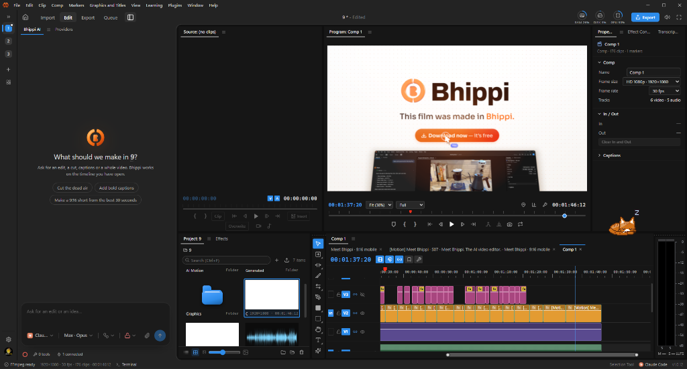
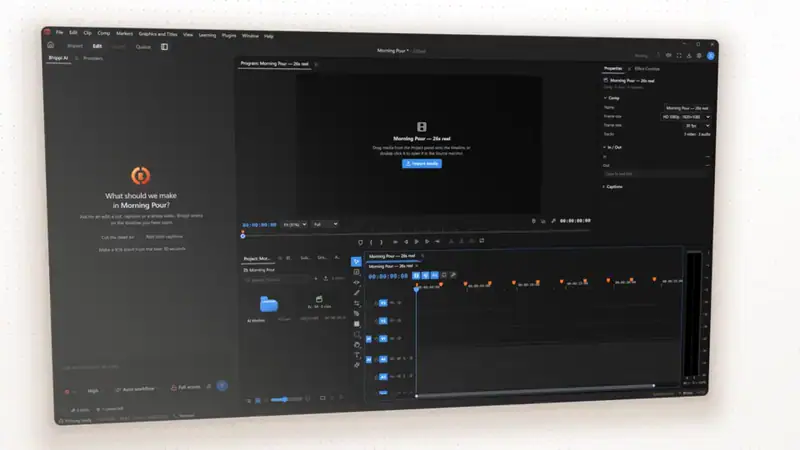
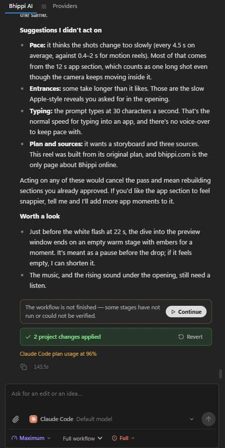
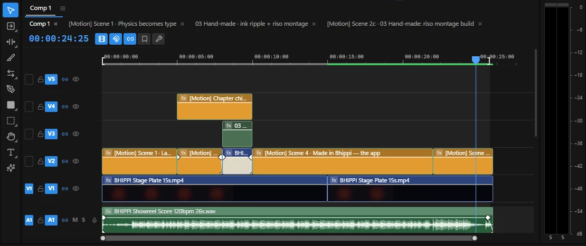
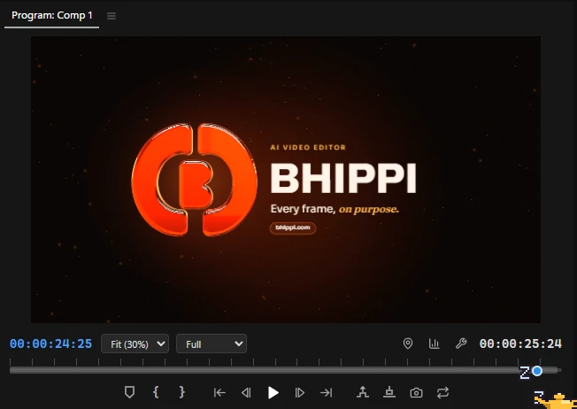
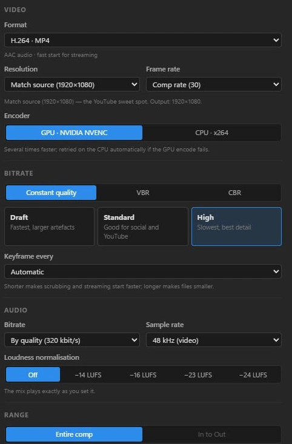

<div align="center">


# Bhippi Video Editor

**The desktop video editor with an AI producer built in.** Windows 10/11 (x64). MIT licensed — free forever, no account, no license key, no credits.

Version 1.0.13

[](https://bhippi.com)
[](LICENSE)
[](https://tauri.app)
[](https://www.rust-lang.org)
[](https://react.dev)
[](https://ffmpeg.org)

[⬇ Download for Windows](https://github.com/memegyanfactory-gif/bhippi-Video-editor/releases) · [Website](https://bhippi.com) · [Quick Start](#quick-start) · [How it Works](#how-the-ai-works) · [Features](#what-it-does) · [Comparison](#how-it-compares) · [Documentation](#architecture--codebase)

---

</div>

<p align="center">
  
  <em>Bhippi Video Editor v1.0.13 in action: multi-track timeline with cut blocks & audio waveforms, dual monitors, project bin, audio VU meters, and the connected AI co-pilot.</em>
</p>

---

## 🎬 Overview

**Bhippi Video Editor** combines the precision of a professional desktop Non-Linear Editor (NLE) with an autonomous AI producer. 

Unlike simple prompt-to-video wrappers, Bhippi gives you a full professional editing suite—unlimited video and audio tracks, ripple and roll edits, bezier-eased keyframes, nested compositions, and real-time waveforms. Operating alongside your timeline is an AI co-pilot that can plan, research, download assets, cut on speech, snap to music beats, apply motion graphics, rotoscope subjects, and review frames.

**Everything runs on your machine:** your footage, your models, and your render. No forced subscriptions, no cloud queue, and no token caps on your own hardware.

---

## 📽️ UI & Motion in Action

<div align="center">
  <table>
    <tr>
      <td width="50%" align="center">
        <strong>⚡ Intelligent First Cut & Speech Sync</strong><br /><br />
        <br />
        <em>The AI analyzes spoken dialogue, cuts dead air, and places synchronized titles automatically.</em>
      </td>
      <td width="50%" align="center">
        <strong>🎞️ Responsive Multi-Track Timeline</strong><br /><br />
        <br />
        <em>Smooth scrubbing, snapping, ripple/roll trimming, slip/slide, and live audio scrubbing.</em>
      </td>
    </tr>
  </table>
  <p>
    📹 <em>Full video clips available: <a href="docs/assets/first-cut-demo.mp4">first-cut-demo.mp4</a> · <a href="docs/assets/timeline-demo.mp4">timeline-demo.mp4</a></em>
  </p>
</div>

---

## ✨ What it does

### 1. Edit like a pro
- **Industry-standard toolset:** Selection, Razor (`C`), Ripple Edit (`B`), Rolling Edit (`N`), Rate Stretch (`R`), Slip (`Y`), Slide (`U`), Pen (`P`), and Type (`T`).
- **Deep timeline control:** Unlimited video and audio tracks, nested sequences, track grouping, master volume, real-time audio meters (dBFS / LUFS), and full undo/redo for every action—including operations executed by the AI.
- **Precision snapping:** Snap cuts to playhead, clip boundaries, markers, or detected musical beats and bar phrases.

### 2. Autonomous AI producer with phase control
- **Collaborative production workflow:** The co-pilot breaks production into transparent, controllable phases:
  $$\text{Plan} \longrightarrow \text{Gather} \longrightarrow \text{Edit} \longrightarrow \text{Polish}$$
- **Full vs. Quick turns:** Need a minor tweak? Click a layer or draw an annotation on the preview monitor—a **Quick turn** focuses only on that element without recalculating a full video blueprint.
- **Persistent AI work:** All generated scripts, storyboards, voice-overs, and frame QA logs stay organized inside your project's `AI Work` bin. Closing the application never loses progress.
- **Over 200 native AI tools:** The AI interacts with your timeline through undoable API calls (`place_clip`, `snap_cuts_to_beats`, `level_audio`, `create_motion_scene`).

### 3. Local media generation — zero cloud credits
- **Local Text-to-Video:** Generate cinematic b-roll with local Wan 2.1 or LTX Video.
- **Image Generation:** Photorealistic stills and backdrops via SDXL.
- **Rotoscoping & Mattes:** Zero-click subject cutouts using Segment Anything 2 (SAM 2) and Robust Video Matting (RVM).
- **Speech & Audio:** Local Whisper speech-to-text transcription, Piper neural voice-over, and Stable Audio sound effect synthesis.
- **Magic Eraser:** Object removal and clean-plate inpainting powered by LaMa.

### 4. GPU motion engine & After Effects-grade graphics
- **WebGL2 Compositor:** Unified motion engine rendering identical frames in both preview and final export.
- **Keyframe animation:** Bezier easing, parenting, track mattes, 17 blend modes, and motion blur.
- **2.5D Camera:** True 3D spatial layers with focal length and depth of field.
- **Vector shape trees:** SVG path morphing, trim paths, gradient strokes, repeaters, and 2,100+ Lucide icons.
- **60+ Motion templates:** Kinetic typography, fly-through words, lower thirds, stat charts, and brand lockups. See [docs/MOTION-ENGINE.md](docs/MOTION-ENGINE.md).

### 5. Headless Blender 3D integration
- When [Blender 4.2+](https://www.blender.org) is detected on your machine, Bhippi can orchestrate headless 3D renders in the background:
  - Glass and chrome orbs, extruded 3D logos, floating device mockups, and crystal refraction.
  - Fast draft previews using EEVEE; final broadcast renders with GPU Cycles raytracing.
  - Transparent alpha passes composite automatically under your 2D timeline layers.

### 6. HTML/CSS motion graphics & React Bits library
- **Crimson Design System:** Premium hook cards, side panels, comparison boards, and animated lower thirds.
- **React Bits & Modern UI:** Deterministic, exportable web animations—including the full 205-piece React Bits catalogue, Magic UI, and Aceternity components. See [docs/REACT-BITS-LIBRARY.md](docs/REACT-BITS-LIBRARY.md).

### 7. Brand Kits & Sound Design
- **Consistent brand identity:** Save your brand colors, fonts, voice tone, layout guidelines, and logos once in **Settings → Brand kit**. The AI automatically applies them to all generated graphics, voice styles, and captions. See [docs/BRAND-KIT.md](docs/BRAND-KIT.md).
- **Built-in SFX synthesizer:** 24 procedural sound effects (UI ticks, typing beds, glass pings, sub-bass drops, whooshes) automatically ducked beneath dialogue and music.

---

## 🔍 Interface Tour

<div align="center">
  <table>
    <tr>
      <td width="50%" align="center">
        <br />
        <strong>AI Co-Pilot & Chat</strong><br />
        <em>Connect Claude Code, Codex, OpenAI, or local Ollama. Phase-guarded workflow with one-click actions.</em>
      </td>
      <td width="50%" align="center">
        <br />
        <strong>Multi-Track Timeline</strong><br />
        <em>Audio waveforms, clip markers, ripple/roll trimming, track locks, and beat-snapping guides.</em>
      </td>
    </tr>
    <tr>
      <td width="50%" align="center">
        <br />
        <strong>Program & Canvas Monitor</strong><br />
        <em>Interactive transform handles, safe-title overlays, annotation pencil, and real-time playback.</em>
      </td>
      <td width="50%" align="center">
        <br />
        <strong>Export & Render Queue</strong><br />
        <em>Presets for YouTube 4K/1080p, TikTok/Reels 9:16, square, ProRes, and background batch rendering.</em>
      </td>
    </tr>
  </table>
</div>

---

## 📊 How it compares

Bhippi combines four discrete workflows into a unified native application: an NLE editor, a motion graphics compositor, an autonomous AI producer, and a local generative engine.

### Editing & Production

| Feature | Bhippi | Premiere Pro | DaVinci Resolve | CapCut | Runway |
| :--- | :---: | :---: | :---: | :---: | :---: |
| **Multi-track NLE** *(ripple, roll, slip, slide, nesting)* | ✅ | ✅ | ✅ | Basic | — |
| **AI that edits timeline via undoable operations** | ✅ | Assistive only | Assistive only | Assistive only | — |
| **Structured Plan → Gather → Edit → Polish pipeline** | ✅ | — | — | Fixed templates | Prompt to video |
| **Transcript-based cutting & sync captions** | ✅ *(Local)* | ✅ | ✅ *(Studio)* | ✅ *(Cloud)* | — |
| **Beat, bar & phrase-aware cut snapping** | ✅ | Partial | Partial | Auto-beat | — |
| **Automated Frame QA** *(safe area, face obstruction, blank frames)* | ✅ | — | — | — | — |
| **Media download** *(YouTube, Instagram, TikTok, X)* | ✅ | — | — | — | — |

### Motion Graphics & 3D

| Feature | Bhippi | After Effects | Resolve (Fusion) | Remotion | Runway |
| :--- | :---: | :---: | :---: | :---: | :---: |
| **Keyframed layers, masks, mattes & blend modes** | ✅ | ✅ | ✅ *(Nodes)* | In code | — |
| **2.5D spatial layers & camera depth-of-field** | ✅ | ✅ | ✅ | In code | — |
| **Vector shapes, trim paths, path operations** | ✅ | ✅ | Partial | In code | — |
| **Natural language scene synthesis from chat** | ✅ | — | — | LLM code-gen | Generative clips |
| **Real 3D render pipeline** *(glass, metal, lights)* | ✅ *(Headless Blender)* | ✅ *(Advanced 3D)* | ✅ *(Fusion 3D)* | ✅ *(Three.js)* | Generative |
| **Component template library** | **60+ engine, 500+ HTML** | Marketplace | Templates | Community | — |
| **Global Brand Kit applied to all graphics** | ✅ | CC Libraries *(Manual)*| — | — | — |

### Privacy & Economics

| Aspect | Bhippi | Premiere / AE | DaVinci Resolve | CapCut | Runway |
| :--- | :---: | :---: | :---: | :---: | :---: |
| **Media stays strictly on local storage** | ✅ | Partial *(Cloud AI)* | ✅ | — | — |
| **Local Text-to-Video & Image synthesis** | ✅ | Cloud *(Firefly)* | — | Cloud | Cloud |
| **Local rotoscoping & subject cutout** | ✅ | Roto Brush | Magic Mask *(Studio)* | Cloud cutout | Cloud |
| **Local neural voice-over** | ✅ | — | — | Cloud | Cloud |
| **Pricing model** | **Free & Open Source** | Monthly subscription | Free / $295 Studio | Subscription + cloud | Credit subscription |

---

## 🧠 How the AI works

The co-pilot adapts to whichever model you connect: **Claude** (Claude Code, Anthropic API), **OpenAI / Codex**, local LLM servers (**Ollama**, **vLLM**, **LM Studio**), or custom API endpoints.

```
       ┌─────────────────┐
       │   User Prompt   │
       └────────┬────────┘
                │
                ▼
      ┌──────────────────┐
      │  Workflow Guard  │ ◄─── Ensures honest phases (no editing before planning)
      └─────────┬────────┘
                │
     ┌──────────┴──────────┐
     ▼                     ▼
┌──────────────┐    ┌──────────────┐
│ Frontier Tier│    │ Guided Tier  │
│(Opus, GPT-5) │    │(Local, 8B-70B│
└──────┬───────┘    └──────┬───────┘
       │                   │
       ▼                   ▼
┌──────────────────────────────────┐
│  200+ Native Timeline AI Tools   │
│  (Cuts, Rotoscoping, Audio, SFX) │
└──────────────────┬───────────────┘
                   │
                   ▼
┌──────────────────────────────────┐
│   Undoable Project State Bin     │
│   (Saved inside project folder)  │
└──────────────────────────────────┘
```

### Essential Tool Categories

| Domain | Key Tools |
| :--- | :--- |
| **Inspection** | `get_comp`, `analyze_clip_speech`, `inspect_clip_frames`, `run_frame_qa`, `review_frames` |
| **Planning** | `online_research`, `save_video_blueprint`, `save_storyboard`, `query_frame_atlas` |
| **Asset Gathering** | `generate_local_media`, `synthesize_speech_voiceover`, `download_online_media`, `scrape_videos`, `capture_app_session` |
| **Audio & SFX** | `analyze_song`, `analyze_music_beats`, `compose_music`, `sound_the_motion`, `level_audio` |
| **End-to-End Films** | `build_edit_from_brief`, `apply_recipe`, `create_product_demo`, `judge_edit` |
| **Timeline Editing** | `apply_edit`, `place_clip`, `snap_cuts_to_beats`, `rotoscope_clip`, `erase_subject_clip` |
| **Motion & Compositing** | `motion_guide`, `create_motion_scene`, `update_motion_scene`, `search_icons`, `track_motion` |
| **3D Rendering** | `list_3d_presets`, `render_3d_scene` *(headless Blender bridge)* |
| **Graphics & Text** | `create_motion_graphic`, `react_bits`, `add_text`, `add_captions` |
| **Brand Management** | `list_brand_kits`, `get_brand_kit`, `create_brand_kit`, `apply_brand_kit`, `render_brand_board` |

---

## 🚀 Quick Start

### Installation

Download the latest installer directly from **[bhippi.com](https://bhippi.com)** or build from source:

#### System Requirements
- **OS:** Windows 10/11 (x64)
- **Node.js:** v20.x or v22.x
- **Rust:** 1.85+
- **FFmpeg:** Installed and available on your system `PATH`
- *Optional:* [Blender 4.2+](https://www.blender.org) for 3D rendering; Python 3.10+ with PyTorch for local AI models.

#### Building from source

```bash
# 1. Clone the repository
git clone https://github.com/memegyanfactory-gif/bhippi-Video-editor.git
cd bhippi-Video-editor

# 2. Install dependencies
npm install

# 3. Launch the desktop application in development mode (hot-reload enabled)
npm run dev

# Or run the browser-only UI preview
npm run dev:web
```

### Initial Configuration
1. Open **Settings → AI providers** to connect your preferred model (API key, Claude Code CLI, or local server).
2. Open **Settings → Local media** to download optional local model weights (SAM 2, Whisper, Piper, SDXL).
3. If you have Blender installed, ensure its path is registered under **Settings → 3D** to unlock the 3D generator.

---

## 🛠️ Architecture & Codebase

```bash
npm run typecheck    # Validate TypeScript types across frontend
npm run test:ui      # Run Vitest test suite
npm test             # Run Vitest + Cargo test suite
npm run lint         # ESLint (Rust: npm run lint:rust, advisory)
npm run bundle       # Package full production NSIS installer
```

### Directory Map

| Path | Purpose |
| :--- | :--- |
| `src/editor/` | Core NLE UI: timeline, canvas monitors, trimmer, audio tracks, and transport controls |
| `src/motion/` | GPU WebGL2 compositor: scene graph, bezier keyframes, 2.5D camera, vector trees |
| `src/lib/aiTools.ts` | The 200+ native AI tool implementations invoked by the co-pilot |
| `src/lib/editWorkflow.ts` | Phase guard ensuring deterministic transitions between planning, gathering, and cutting |
| `src/lib/blender3d.ts` | Headless Blender subprocess bridge, scene templates, and Cycles render dispatch |
| `src/lib/filmRecipes.ts` | Complete film templates (product demo, kinetic explainer, SaaS walkthrough) |
| `src/lib/rbx/` | Component library containing React Bits, Animate.css, and interactive UI widgets |
| `src/lib/brandKit/` | Brand kit management, archetypes, color palettes, and typographic scales |
| `src-tauri/src/` | Native Rust backend: project state serialization, FFmpeg pipelines, local model workers |
| `docs/` | Deep-dive architectural specs: [Motion Engine](docs/MOTION-ENGINE.md), [Brand Kit](docs/BRAND-KIT.md), [React Bits](docs/REACT-BITS-LIBRARY.md) |

---

## 📄 License

Bhippi Video Editor is open source software licensed under the **[MIT License](LICENSE)**.
