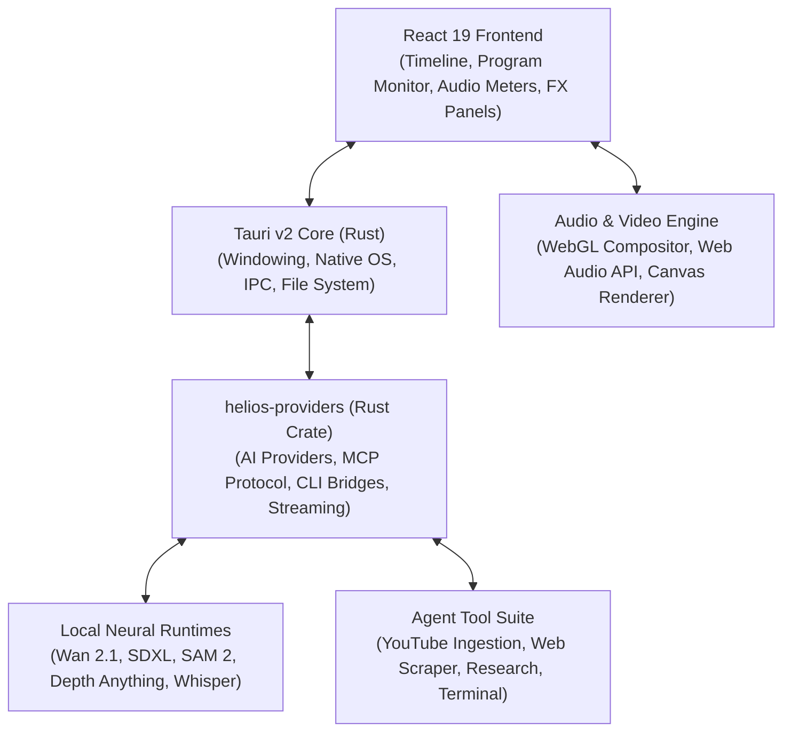

# ☀️ Helios

> **The Next-Generation AI-Native Non-Linear Video Editor (NLE)**  
> *Professional human editing meets autonomous AI co-pilots and local neural generation.*

[](https://www.rust-lang.org/)
[](https://tauri.app/)
[](https://react.dev/)
[](https://www.typescriptlang.org/)
[](https://vitejs.dev/)
[](https://onnxruntime.ai/)
[](https://ffmpeg.org/)

---

## 📖 Overview

**Helios** is a high-performance desktop video editing suite engineered from the ground up to unite **industry-standard Premiere Pro-style NLE workflows** with **cutting-edge on-device neural AI models** and **autonomous agent tooling**.

Traditional video editing software was designed decades ago for manual timeline assembly. Modern code-only renderers (like Remotion or HyperFrames) allow programmatic video generation but lack a tactile, interactive visual workspace for real humans editing multi-gigabyte footage. 

**Helios bridges both worlds**:
- **For Creators**: A lightning-fast, zero-lag 60 FPS timeline with magnetic snapping, ripple editing, razor cuts, bezier keyframes, audio scrubbing, waveforms, and hardware-accelerated color grading.
- **For AI Agents**: A fully programmable workspace where autonomous co-pilots (Claude Code, Codex, Gemini, Antigravity, OpenCode) can perform research, download reference footage from YouTube, synthesize new assets using local neural models, and edit timeline clips via typed tool protocols.

---

## ⚡ Key Highlights

### 🎬 1. Professional Premiere-Parity NLE Timeline
- **Multi-Track Architecture**: Unlimited Video ($V_1 \dots V_n$) and Audio ($A_1 \dots A_n$) tracks with individual track locks, sync locks, target patching, and solo/mute toggles.
- **Precision Toolset**:
  - `V` **Selection Tool**: Non-destructive clip manipulation, drag-and-drop overwrite or insert.
  - `C` **Razor Tool**: Frame-accurate slicing across single tracks or all unlocked tracks.
  - `B` **Ripple Edit** & `N` **Rolling Edit**: Dynamic head/tail trims with automatic timeline gap closure.
  - `R` **Rate Stretch**: Real-time clip speed modification with optional pitch preservation.
  - `Y` **Slip** & `U` **Slide**: Adjust source in/out points while preserving timeline duration and position.
  - `P` **Pen Tool**: Direct bezier rubber-band keyframing on clips for opacity, volume, and masks.
  - `T` **Type Tool**: On-monitor kinetic typography and caption authoring.
- **Nested Compositions**: Full support for multiple sequences, comp tabs, and hierarchical nested comps.
- **Real-Time Preview**: 60 FPS GPU-accelerated rendering powered by WebGL/Canvas compositing and Web Audio API.

### 🧠 2. Local-First Neural AI Suite (Zero Cloud Latency)
Helios runs state-of-the-art computer vision and generative models directly on your local hardware:
- **Wan 2.1 Video Generation**: Generate photorealistic b-roll and synthetic video sequences directly from text prompts.
- **SDXL Image Generation**: Studio-quality visual assets, backgrounds, textures, and title cards.
- **SAM 2 & ViTMatte (Neural Rotoscoping)**: Point-and-click or prompt-based subject matting with hair-level alpha extraction for instant green-screen-free cutouts.
- **Depth Anything (v2/v3)**: High-resolution monocular depth estimation for cinematic 3D parallax, depth-of-field blur, and text-behind-actor effects.
- **Whisper Transcription**: Fast on-device speech-to-text engine generating word-level kinetic captions and subtitle tracks.
- **Stable Audio FX**: Local neural synthesis of custom sound effects, foley, and ambient soundscapes.

### 🎨 3. Programmatic Motion Graphics & MOGRTs (HTML/CSS/GSAP)
- **Code-as-Video MOGRT Overlays**: Professional motion graphics written in standard HTML5, modern CSS (glassmorphism, CSS variables, keyframes), and seekable GSAP timelines.
- **Nested Comp Packaging**: Autonomous agents can generate custom motion designs and automatically place them into dedicated compositions nested on Track V2 or V3 above primary video clips.
- **Frame-Accurate Scrubbing**: GSAP timelines and CSS variables (`--elapsed`, `--progress`, `--time`) sync with the playhead for zero-lag scrubbing and 60 FPS preview.
- **Pre-Built Designer Templates**: Glassmorphism lower-thirds, kinetic typography titles, animated stat/metric callouts, feature badges, social banners, and countdown timers — or custom web code synthesized on demand.

### 🤖 4. Autonomous AI Co-Pilot & Developer Tool Engine
Helios exposes a unified system and developer tool architecture accessible to both its built-in editor agent and external coding CLI/MCP agents (Claude Code, OpenAI Codex, OpenCode, Gemini):
- **Automated Research & Asset Scraper**: Agents can explore subjects online, scrape relevant high-resolution imagery and video references, and automatically structure them into dedicated project asset bins.
- **YouTube Media Ingestion**: Direct video ingestion tool supporting format resolution, clip cropping, frame trimming, and audio channel isolation (with or without sound).
- **Timeline Manipulation API**: Agents can programmatically inspect comps, slice clips, adjust color wheels, configure transitions, and position audio tracks.
- **Local Filesystem & Terminal Execution**: Execute scripts, run build commands, manage workspace dependencies, and batch-process media files securely.

---

## ⚖️ How Helios Compares

| Feature | Legacy NLEs (Premiere / Resolve) | Code Renderers (HyperFrames / Remotion) | **Helios** |
| :--- | :---: | :---: | :---: |
| **Interactive Desktop UI** | ✅ Comprehensive | ❌ None (Headless/Code only) | **✅ 60 FPS Native Desktop UI** |
| **Multi-Track Timeline & Scrubbing** | ✅ Industry standard | ❌ Painful in raw code | **✅ Full Premiere-Parity NLE** |
| **Real-Time Audio Waveforms & Meters** | ✅ Hardware accelerated | ❌ None / Post-render | **✅ Web Audio Engine + Peak Meters** |
| **Local Neural Inference (Wan, SDXL, SAM2)** | ❌ Cloud add-ons or None | ❌ None (Relies on external APIs) | **✅ Built-in On-Device AI Models** |
| **AI Agent Co-Pilot (MCP & Tool Calling)** | ❌ Proprietary or Limited | 🟡 LLM writes code scripts | **✅ Full Multi-Agent Tool Protocol** |
| **Web Research & YouTube Ingestion** | ❌ Manual download required | ❌ None | **✅ Autonomous Ingestion Tools** |
| **Pricing & Freedom** | ❌ Expensive Monthly Subscriptions | ✅ Open source | **✅ Open Source & Local First** |

---

## 🏗️ Architecture

Helios is built as a multi-tier, high-performance hybrid desktop system:



- **Frontend**: React 19, TypeScript 5.8, Tailwind-free bespoke CSS design system, Lucide icons, marked & DOMPurify.
- **Desktop Host**: Tauri v2, Rust 1.85, Tokio multi-threaded async runtime.
- **Provider Crates** (`crates/helios-providers`): Clean provider abstraction supporting Anthropic, OpenAI-compatible APIs, Ollama, and local CLI tools.
- **Local Machine Learning**: ONNX Runtime WebAssembly SIMD/threaded backend, PyTorch local runtime hooks for Wan 2.1 and SAM 2.
- **Media Pipeline**: FFmpeg CLI integration for high-performance audio/video remuxing, frame extraction, and final render pipeline.

---

## 🚀 Quick Start

### Prerequisites
- **Node.js**: v20.x or v22.x LTS
- **Rust**: 1.85+ (`rustup default stable`)
- **FFmpeg**: Installed and available on your system `PATH`
- **Python**: 3.10+ with PyTorch (optional, required for local GPU neural model inference)

### Installation

1. **Clone the repository**:
   ```bash
   git clone https://github.com/memegyanfactory-gif/Helios.git
   cd Helios
   ```

2. **Install frontend dependencies**:
   ```bash
   npm install
   ```

3. **Launch in development mode**:
   ```bash
   npm run dev
   ```
   *This starts the Vite development server and launches the Tauri v2 desktop application with hot module reloading.*

4. **Web-only preview mode**:
   ```bash
   npm run dev:web
   ```

---

## 🧪 Testing & Validation

Helios maintains rigorous test suites across both the frontend editing engine and Rust backend crates:

```bash
# Run all tests (frontend Vitest + Rust workspace tests)
npm test

# Run frontend tests only (240+ unit and integration tests)
npm run test:ui

# Run Rust provider crate tests only (98 tests)
cargo test --package helios-providers

# Type check TypeScript codebase
npm run typecheck

# Code quality and linting
npm run lint
```

---

## 📂 Project Structure

```text
Helios/
├── agent/               # Autonomous AI agent definitions and workflows
├── backend/             # Local neural inference scripts (SAM2, Depth, Wan, SDXL)
├── crates/
│   └── helios-providers/# Core Rust crate: AI models, CLI bridges, tool protocols
├── docs/                # Architectural roadmaps, parity plans, and guides
│   ├── premiere-parity-plan.md
│   ├── LOCAL-MEDIA-IMPLEMENTATION.md
│   └── DEPTH-INTEGRATION.md
├── public/              # Static assets, WebAssembly SIMD binaries (ONNX runtime)
├── scripts/             # Build and launch automation scripts
├── src/                 # React 19 UI & Editing Engine
│   ├── components/      # Timeline, Track Headers, Program Monitor, Audio Meters
│   ├── lib/             # Editing engine, keyframing, transitions, Web Audio
│   └── types/           # Core domain types (Comps, Clips, Tracks, Markers)
├── src-tauri/           # Tauri v2 native desktop configuration and bindings
├── tests/               # Vitest test suites (Timeline engine, Tools, Media)
└── tools/               # Autonomous agent developer tools (YouTube, Scraper, etc.)
```

---

## 🗺️ Roadmap

- [x] **Project v3 Multi-Comp Model**: Unlimited tracks, freely placed clips, linked A/V, transition blocks.
- [x] **Core NLE Engine**: Overwrite, insert, ripple delete, slip, slide, rate stretch, razor slicing.
- [x] **On-Device AI Engine**: Wan 2.1 video generation, SDXL image gen, SAM2 rotoscoping, Depth Anything v2/v3.
- [x] **Agent Developer Tools**: YouTube auto-ingestion (with crop/trim/mute), web scraper, project bin organizer.
- [x] **Comprehensive Provider Bridge**: Support for Claude Code, Codex, Gemini, Ollama, and OpenCode.
- [x] **MOGRT HTML/GSAP Templates**: Declarative web motion graphics with real-time seeking and nested comp overlays.
- [ ] **Multi-Camera Editing**: Synchronized multi-angle switching and timeline audio phase alignment.
- [ ] **Hardware H.265 / AV1 Export**: Direct NVENC / QuickSync GPU accelerated export pipelines.

---

## 🤝 Contributing

Contributions are welcome! Whether you are interested in refining the NLE timeline engine, optimizing local AI model quantization, or expanding the agent tool ecosystem:

1. Fork the Project
2. Create your Feature Branch (`git checkout -b feature/AmazingFeature`)
3. Commit your Changes (`git commit -m 'Add some AmazingFeature'`)
4. Push to the Branch (`git push origin feature/AmazingFeature`)
5. Open a Pull Request

---

## 📄 License

Distributed under the MIT License. See `LICENSE` for more information.

---

<p align="center">
  Built with ☀️ by the Helios Team
</p>
