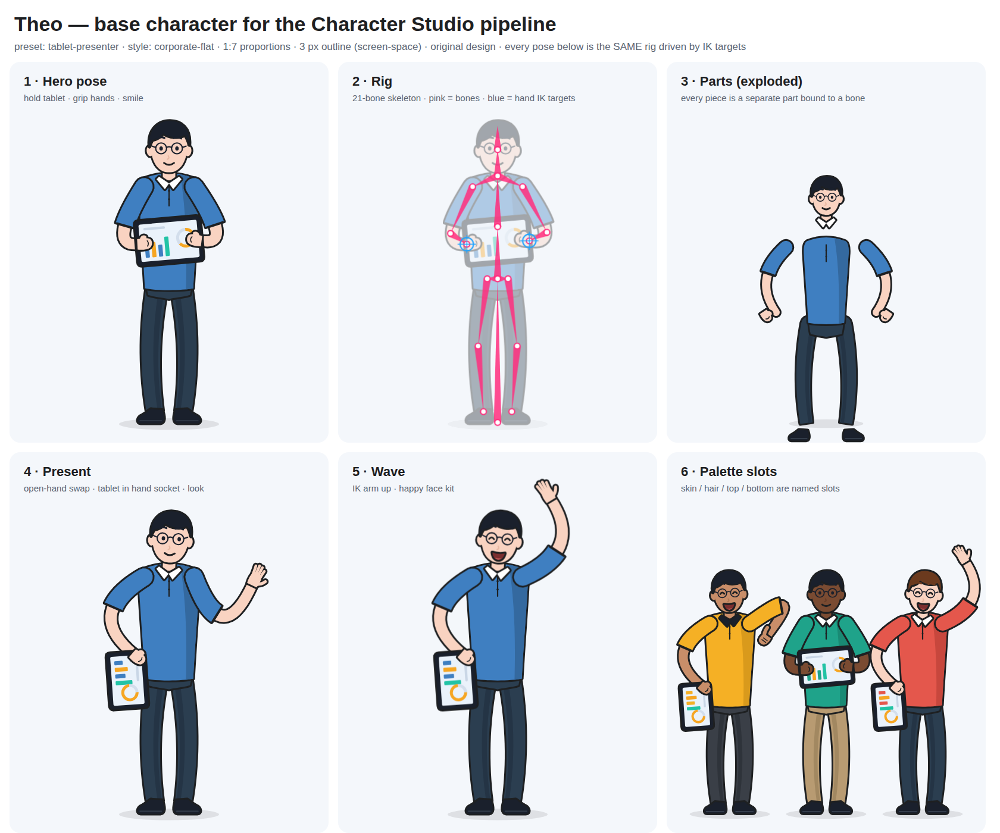

# Character Studio plan: rigged explainer characters the AI can drive

Goal: characters that **look, feel and move** like the reference film
([MH Explain, "2d motion graphic explainer animation ads"](https://www.youtube.com/watch?v=l5pwbWC1ay8), 33 s),
built from a real rig and asset format, with a library of characters, and tool calls that let the AI make a
whole character beat in one or two calls.

This plan builds on what exists (C2 in `newmotionupdate25092026.md`, P8 in `docs/REFERENCE-FILMS-PLAN.md`).
It keeps the P8 `CharacterAsset` idea and turns it into a full pipeline.

---

## 1. What the reference actually does

**How it was studied.** This container's network blocks YouTube, so the frames were not pulled here.
The film was watched twice through a video-analysis tool: once for the style and once second by second for
the motion. Treat colour hex values as close estimates. Before Phase 1 closes, check them against real
frames on a desktop (§8, step 0).

### 1.1 The look
- **Style:** corporate flat vector (the Illustrator + After Effects explainer look).
  - Thin dark outline, about `#1E2022`, at a constant width. The line does **not** scale when the
    character scales.
  - Flat fills, with the odd 2-tone block shadow.
  - No grain and no gradients on the characters.
- **Proportions:** about **1 : 6.5–7** (head to body), semi-realistic. This is very different from the
  current chibi `dome-kid` and `shape-buddy`.
- **Face:** dot eyes, line brows, a single curved-line smile, round glasses. There are no mouth shapes and no
  blinks.
- **Palette (estimated):**

  | Part | Colour |
  |---|---|
  | Skin | `#F9D3C1` / `#FAD6C4` |
  | Hair, shoes | `#1A202C` |
  | Polo | `#4682B4` |
  | Blazer | `#1A60C8` |
  | Hoodie | `#F5B025` |
  | Accent top | `#F6A623` |
  | Headphones | `#00BCD4` |
  | Trousers | `#2B3E50` |

- **Cast (4 characters):**
  1. A man standing with a tablet.
  2. A woman seated at a laptop.
  3. A man holding documents, inside a framed card.
  4. A seated animator seen from the back, with headphones.
- **Props are part of the pose:** a tablet, a laptop, paper documents, a chair, a desk and monitors.

### 1.2 The motion (the important finding)
The characters themselves **barely move**. The "fluid, premium" feel comes from the motion design around
them.

- **Entrances:**
  - A scale pop from 0 to 100 % with an overshoot, over about 12–15 f.
  - Or a masked slide up from behind a UI bar or card, over about 15 f.
- **Body:** forearms and hands make small **hinged** moves (typing, holding papers with a gentle float).
  Torsos and legs are held. The only breathing is on the back-view animator: a 1–2 px bob loop.
- **Around the character:** UI cards and charts orbit on a cylindrical path with perspective. Bars and coins
  rise with bounce easing, and cards pop in one after another, each about 10–12 f with an overshoot.
- **Timing:** everything is **on ones at 30/60 fps** with smooth bezier eases.
  - This is the opposite of the MDS film, which runs on twos (the current character default).
- **The one full-body animation:** the walk cycle on the animator's monitor (0:12–0:15).
  - It is the classic contact → down → passing → up cycle.
  - Knees and elbows bend smoothly (bendy limbs), arms swing opposite to the legs, and the body bobs up and
    down on a sine.
- **Likely tools:** After Effects with a Duik / Limber / RubberHose cutout rig, and art from Illustrator.

**What this means for the build.** "Looks the same" needs three things:
1. A new **art style**: corporate-flat at 1:7, outlined, with props.
2. Motion **on ones with overshoot eases**.
3. **Staging templates**: a character plus UI orbiting, popping or sliding around them.

"Animates very fluidly" asks for more than the reference shows. That needs a real rig with bendy limbs,
blending, secondary motion and good walk cycles. This plan aims above the reference on motion and at the
reference on look.

**What we will not copy.** The reference characters themselves are someone else's art. We build **original
characters in the same style**. The style is not protected; their drawings are.

---

## 2. Where Bhippi is today (gap analysis)

| Area | Today | Needed |
|---|---|---|
| Asset format | None. Three characters hard-coded in `src/motion/character/draw.ts` and `pose.ts` (`RIGS`) | A data-driven `CharacterAsset` (bones, parts, views, face, hands, sockets, styles) loaded from JSON |
| Characters | 3 procedural (`dome-kid`, `shape-buddy`, `flat-corporate`); chibi proportions | A library of 20+ presets plus a modular builder (thousands of combinations) in the corporate-flat style |
| Skeleton | A proportion table, no hierarchy | A standard humanoid skeleton (§3.1) shared by every character, so every clip works on every character |
| Limbs | A quadratic "hose" stroke with no outline | Bendy tube limbs **with an outline**, taper, cuffs and sleeves; optional hinged mode |
| Line | Scales with the layer | A constant screen-space line width (non-scaling stroke) |
| Hands | Circles | A hand swap set (about 12 poses: open, fist, point, hold, grip-tablet, type, thumbs-up, wave…) |
| Views | Front only (head roll) | Front, 3/4, side and back, with draw-order swaps |
| Props | None | Sockets and grip points; tablet, laptop, papers, phone, mug, chair, desk, monitor |
| Poses | Standing only | Stand, sit, sit-typing, lean-on-desk, present, hold-object |
| Motion | Closed-form action envelopes, twos by default | A clip library with blending, ones by default for this style, procedural layers (breath, weight shift, look-at, springs), foot planting, mocap retargeting |
| Secondary motion | None | Springs on hair, ties, drawstrings, lanyards and papers |
| Lip sync | Letters → mouth | Rhubarb phonemes (A–H, X) when present; word-timing fallback |
| Entrances / staging | Up to the AI to build by hand | One-call staging templates (pop, mask-slide, UI orbit, card frame) |
| AI tools | `create_character`, `animate_character`, `lip_sync_character`, `list_character_actions` | + `list_characters`, `design_character`, `pose_character`, `attach_prop`, `stage_character_scene`, `character_qa` |
| QA | 9 unit tests, GPU stills | Contact sheets, a foot-slide metric, face-occlusion and limb-crossing checks, a Character Lab page |

---

## 3. The system

```
 Art (SVG parts) ──► Rig Lab (bind parts to bones, set pivots) ──► CharacterAsset JSON ─┐
 CC0 packs ──► Cutter (split static art into parts) ──────────────────────────────────┤
 Builder (body × outfit × hair × face × palette) ─────────────────────────────────────┘
                                                                                        ▼
 Clips (keyed + mocap-retargeted) ─► Motion solver (blend, IK, procedural layers, springs) ─► Pose
                                                                                        ▼
                                              Renderer (Path2D / tube limbs / mesh) ─► canvas ─► GL layer
                                                                                        ▲
                   AI tools (high-level intents) ─► character layer data (scene JSON) ──┘
```

### 3.1 Standard skeleton (every character, every clip)

There are 21 bones. Each has a pivot and a rest angle in the character's own pixels, with the origin between
the feet and +y pointing down, as today.

```
root
└─ pelvis
   ├─ spine ─ chest ─ neck ─ head ─ (face: eyeL, eyeR, browL, browR, mouth, hairFront*, hairBack*)
   │                 ├─ upperArmL ─ foreArmL ─ handL   (socket hand#L)
   │                 └─ upperArmR ─ foreArmR ─ handR   (socket hand#R)
   ├─ thighL ─ shinL ─ footL
   └─ thighR ─ shinR ─ footR
```

- `*` hair and accessory bones are optional spring chains.
- Characters of different sizes share the skeleton **topology**. Only the lengths differ, so clips are
  stored as **angles plus normalised IK targets** and retarget for free.

### 3.2 `CharacterAsset` v1 (extends P8)

```ts
type CharacterAsset = {
  id: string; name: string; version: 1;
  license: { source: 'original' | 'cc0'; origin?: string };      // must be set; the loader refuses others
  style: { line: number /* px at 1080p, screen-space */; lineColor: string; shade?: { tone: number; angle: number } };
  skeleton: { id: BoneId; parent?: BoneId; pivot: Vec; angle: number; length: number }[];
  parts: Part[];                                                   // drawn in view order
  views: Record<'front' | '3q' | 'side' | 'back', { order: string[]; swaps?: Record<string, string>; mirror?: boolean }>;
  face: { eyes: EyeKit; brows?: BrowKit; mouths: Record<Viseme | Expression, PathSet>; glasses?: PathSet };
  hands: Record<HandPose, { front: PathSet; side?: PathSet }>;
  sockets: Record<string, { bone: BoneId; offset: Vec; angle?: number }>;
  springs?: { bones: BoneId[]; stiffness: number; damping: number; gravity?: number }[];
  palette: Record<string, string>;                                 // named slots: skin, hair, top, top2, bottom, shoe, accent…
  presets?: Record<string, Partial<Record<string, string>>>;       // outfit colourways
};
type Part =
  | { id; bone; kind: 'path'; d: string; fill: Slot; stroke?: boolean; z?: number }          // rigid, on one bone
  | { id; bones: [BoneId, BoneId]; kind: 'tube'; width: [number, number, number]; fill: Slot; cuff?: CuffSpec; mode?: 'bendy' | 'hinged' } // limb
  | { id; kind: 'mesh'; d: string; fill: Slot; weights: VertexWeights }                     // torso or skirt that bends
  | { id; bone; kind: 'swap'; set: Record<string, PathSet> };                                // hands, mouths, special drawings
```

- Path data is plain SVG `d`, so art from Inkscape, Figma or Illustrator drops in.
- A JSON Schema lives beside the TS type, so the AI and the importer validate the same way.

### 3.3 Renderer v2 (`src/motion/character/render.ts`)

- **Bone transforms** are world matrices from the skeleton and the pose. Rigid parts draw through `Path2D`
  plus `setTransform`, so there is no per-frame path rebuilding.
- **Tube limbs** give the "bendy" look (Limber/RubberHose).
  - The centreline is a cubic through shoulder → elbow → wrist.
  - A `bendy` amount (0 = hinged, 1 = a full hose) sets the curvature.
  - Width is sampled along the curve (shoulder / mid / wrist). The outline is drawn as the fill stroked at
    `width + 2·line` first, then the fill on top. Sleeves are a second tube, clipped to a length.
  - The same code does legs and knees.
- **Mesh parts** (torso twist, a jacket that bends at the waist):
  - Triangulated once (earcut, MIT).
  - Linear-blend skinning by weights.
  - Drawn as clipped triangles on Canvas2D. A WebGL path can come later if profiling asks for it.
- **Constant line width.** Stroke widths are divided by the layer's world scale, so a pop-in from 0→100 %
  keeps a 2 px line, as the reference does.
- **Views.** A view switch swaps part order and parts. A turn plays `front → 3q → side` over 2–3 frames of
  swapped drawings (the explainer way), not a morph.
- **Quality:**
  - Draw at 2× and downsample for anti-aliasing.
  - Optional motion blur for fast gestures (shutter 180°, 4 sub-samples), off by default.
- Output is the same canvas → texture path as now (`gl/renderer.ts:222`), so preview and export stay
  identical.

### 3.4 Motion v2 (`src/motion/character/motion/`)

Everything stays **pure and closed-form (t → pose)**, as today, so export is frame-exact and the renderer can
scrub.

The one exception is springs. They are simulated at a fixed 120 Hz from the clip start, cached per layer, and
deterministic by seed.

1. **Clips.** A clip is a set of keyed channels on bones: angles, IK targets, swaps, face, all with per-key
   bezier eases.
   - They are stored in JSON, in `src/motion/character/clips/*.json`.
   - Loops (idle, walk, run, type) are flagged cyclic, with contact markers.
2. **The blend tree.** Base locomotion or pose, then additive gestures and upper-body overrides with masks
   (the arms can wave while the legs walk), then face, then look-at and IK.
   - Crossfades use 6–10 f with ease-in-out, so actions never snap.
3. **Procedural layers** (all on by default for the corporate-flat style):
   - breathing: chest scale 1–1.5 %, a 3.5 s period;
   - a weight shift every 4–7 s;
   - a micro head settle after gestures;
   - an automatic blink (the existing measured blink);
   - look-at with the head lagging the eyes by 3 f;
   - overshoot on every gesture end (the existing envelope maths).
4. **Locomotion:**
   - walk (4 keys: contact/down/pass/up, 12–14 f a step), run and sneak;
   - **foot planting**: a planted foot's world x is locked and the hip is solved by IK, so there is no
     sliding (checked by the QA metric);
   - turn in place;
   - sit down / stand up (with a chair socket).
5. **Mocap retargeting (fluid motion for free).**
   - An importer reads BVH (joint map, 3D → 2D projection on the chosen view plane, angle retarget to the
     standard skeleton, then a clean-up pass with key reduction and eases).
   - The same idea is used by Meta AnimatedDrawings (MIT).
   - Source: **CMU Graphics Lab mocap**. It is free for commercial products, but the raw data may not be
     resold, so we ship only our **converted, cleaned clips**, never the BVH pack.
   - About 40 curated clips: walks (normal, brisk, tired, happy), run, sit/stand, gestures (explain, count
     on fingers, point, shrug, clap, thumbs-up), idle variants.
   - Keyed "hero" clips are made by hand where mocap reads too realistic for the flat style. Mocap gives the
     timing; the style pass exaggerates it.
6. **Timing.** `step` stays (ones, twos, threes), but the **corporate-flat default is ones**. The MDS
   characters keep twos.
7. **Secondary motion.** Springs on hair tufts, ties, lanyards, drawstrings and paper stacks.

### 3.5 Content: where the characters come from

**A. Original art, drawn from scratch in the reference style (the main source).**
- Written as SVG part templates against the standard skeleton, in one **style bible**:
  - 1:7 proportions (adult) and 1:5 (casual);
  - a 2 px line at 1080p in `#1E2022`;
  - 2-tone shading at 18 % darker, from top-left;
  - dot eyes, line brows, 12 mouths, round and rectangular glasses.
- **The modular builder** (Open Peeps-style combinatorics on a rig):
  - **Bodies:** 4 builds (slim, average, broad, curvy) × 2 heights. Each is a skeleton length set plus
    torso and limb widths.
  - **Heads:** 6 face shapes, 6 skin tones (with the reference's two), 16 hairstyles (short, bun, curly,
    long, bald, hijab…). Hairstyles with spring bones.
  - **Outfits:** 14 (polo, blazer + shirt, hoodie, sweater, t-shirt, dress, lab coat, apron, suit + tie,
    kurta, sari drape, overalls…), each with front / 3q / side / back.
  - **Accessories:** glasses ×3, headphones, cap, lanyard badge, watch, backpack.
  - **Hands:** 12 poses × 4 skin tones, generated from one path set with the skin slot.
- **Presets:** 20 named characters so the AI can say "the analyst". The reference cast is recreated as
  originals: `tablet-presenter`, `laptop-worker`, `document-exec`, `desk-creator-back`.

**B. Free CC0 packs (supplementary, imported through the Cutter).**
- These are static drawings, not rigs. The **Cutter** (in the Rig Lab):
  1. splits an SVG into groups;
  2. lets you (or auto-suggest) assign groups to bones;
  3. fills joint gaps with tube or mesh parts;
  4. saves a `CharacterAsset`.
- **Allowed** (download from the original release only):
  - **Open Peeps** (CC0, about 584k combinations, hand-drawn look);
  - **Humaaans** (CC0);
  - **Open Doodles** (CC0);
  - **DiceBear** CC0 styles (Notionists, Lorelei, Open Peeps) for **heads and avatars only**;
  - **RGS_Dev CC0 modular vector characters** (itch.io);
  - CC0 items from the Tiddybub `2d-assets` list, after checking each one.
- **Not allowed** (bundled or used for training):
  - **unDraw**: its licence forbids packs, integrations and ML use;
  - **Freepik / Storyset / Vecteezy free**: attribution required, redistribution in a tool forbidden;
  - **Blush-hosted** copies (subscription terms);
  - **LottieFiles** (already a rule);
  - **OpenMoji** (CC BY-SA, which is share-alike);
  - **Bandai Namco mocap** (non-commercial);
  - Mixamo (fine inside a user's own project, but not ours to redistribute).
- Every asset carries `license.source` and `origin`. The loader refuses anything without them, and
  `THIRD-PARTY.md` lists each pack.

**C. User and AI characters (Phase 7).**
- Import the user's own SVG or PNG through the Cutter.
- "Animate a drawing": AnimatedDrawings-style pose detection, then auto-bind, then ARAP mesh.
- AI-designed characters: the LLM picks builder parameters (always possible). Later, an image model draws a
  turnaround sheet, then vtracer vectorises it, then segment, then auto-rig.

### 3.6 Props and staging

- **Props** are assets too: a path set, grip points and a socket. The first set covers tablet, laptop (open,
  with a screen slot for UI), document stack, phone, mug, pen, chair (office, stool), desk, monitor ×2,
  headphones and a coffee cup.
  - A grip clip pose-matches the hand (`grip-tablet`, `type`, `hold-papers`).
  - A **screen slot** accepts any comp or UI screen (`create_ui_screen`) as a texture. The laptop and monitors
    then show real, moving UI, like the reference's animator scene.
- **Staging templates** (motion-scene macros that place the character, props and motion graphics in one
  call):
  1. `presenter-orbit`: a character pops in (0→100 %, 14 f, 10 % overshoot), holding a tablet; 3–5 UI cards
     orbit on a tilted ellipse with depth scaling and a fade behind.
  2. `card-frame`: a character masked inside a rounded card; slides up from behind the card edge (15 f);
     papers float with a gentle bob.
  3. `desk-worker`: seated at a laptop, with a typing loop, a screen slot and bars or coins rising beside the
     worker.
  4. `back-view-creator`: seen from behind at monitors, with a breathing loop and monitors playing comps.
  5. `walk-across`: walk in, stop with a settle, gesture, then an exit.
  6. `talking-head`: from the chest up, with lip sync, blinks and small gestures.
  7. `group-row`: 3–5 builder characters pop in one after another (4 f stagger).

### 3.7 Face and lip sync

- **Mouths:** Rhubarb's 9 shapes (A–F plus G, H, X), with the existing expression mouths. Each style's face kit
  maps to them.
- **Rhubarb Lip Sync** (MIT) is an optional download (P8 already measured it: a 28 s voice-over in 2.5 s with
  `-d transcript`).
  - It runs from Rust, as with other local tools.
  - Its result is baked as mouth keys.
- Fallback: word timings → visemes (today's path, improved with a small grapheme-to-phoneme table).
- Corporate-flat faces default to a **still smile plus blinks and look-at**, as in the reference. Lip sync
  switches on only when the character talks.

---

## 4. AI tool calls (the AI directs, the engine does the craft)

**Design rules.**
- The AI speaks in **intents, seconds and scene pixels**.
- One call can build a whole beat.
- Every result returns a **still or contact-sheet path** and the **QA warnings**, so the AI can check its
  work.

| Tool | Purpose | Key params |
|---|---|---|
| `list_characters` (READ) | The library: presets, builder options, props, clips, templates, with tags and thumbnails | `filter`, `style` |
| `design_character` | Build or recolour a character from builder parts or a brand palette; saves an asset to the project | `preset?`, `build`, `skin`, `hair`, `outfit`, `accessories[]`, `palette`, `style: 'corporate-flat' \| 'mds' \| 'peeps'`, `name` |
| `create_character` (extended) | Place a character (asset id or preset) | + `asset`, `view`, `pose`, `props[]`, `enter: 'pop' \| 'slide-up' \| 'mask' \| 'walk-in' \| 'none'` |
| `animate_character` (extended) | Timed actions | Actions gain: `sit`, `stand`, `present`, `explain`, `count`, `hold`, `give`, `type`, `read`, `clap`, `thumbs-up`, `turn-to`, `walk-to`, `exit`; `blend`; `mood` (a whole-body modifier: energetic, calm, tired) |
| `pose_character` | Hold an exact pose: a named pose or IK targets per hand and foot, look target, hand swaps, view | `pose`, `hands`, `feet`, `look`, `view`, `at` |
| `attach_prop` | Put a prop in a socket or place it in the scene; screen slot from a comp or UI screen | `prop`, `socket`, `screen?` |
| `stage_character_scene` | One call → one of the 7 templates, fully animated | `template`, `characters[]`, `props`, `ui[]`, `duration`, `brand` |
| `lip_sync_character` (upgraded) | Rhubarb when installed, else words | + `engine: 'auto' \| 'rhubarb' \| 'words'` |
| `character_qa` (READ) | Renders a contact sheet (every 6 f) and runs the checks | `clipId`, `layerId`, `from`, `to` |
| `list_character_actions` (READ) | Kept; now lists clips and actions with durations | |

- The `character-explainer` playbook in `motionDirection.ts` gains a **`corporate-flat` recipe** from §1 (ones,
  pop and slide entrances, UI orbit, 12–15 f moves, 10 % overshoot). `copilot.md` gets the licence rules.
- Tools live in `src/lib/characterTools.ts`; specs go in `src/lib/ai-tools.json`; routing goes through
  `motionTools.ts`; permissions go in `permissions.ts`, as today.

**Example: the AI rebuilds reference beat 1 in one call.**
```json
{ "tool": "stage_character_scene", "args": {
  "template": "presenter-orbit", "duration": 5,
  "characters": [{ "preset": "tablet-presenter", "palette": { "top": "#4682B4" } }],
  "ui": [{ "kind": "chart-line" }, { "kind": "dashboard" }, { "kind": "donut" }],
  "brand": "project" } }
```

---

## 5. Quality bar and QA

**Automatic checks** (`character_qa` and the tests):
- **Foot slide:** a planted foot moves less than 0.5 px per frame.
- **Face occlusion:** hands and props cover less than 25 % of the face, unless it is a facepalm.
- **Limb crossing and inverted elbows.**
- **Off-canvas:** the whole body stays inside the layer box.
- **Line width:** constant across scale.
- **Snapping:** no action boundary snaps without a blend.
- **Pops:** no pop without an overshoot in the corporate-flat style.

**Reference parity (the acceptance test for this plan):**
- Rebuild the reference's four character shots with original characters, using templates 1–4.
- Render both at 1080p and compare them side by side on a contact sheet (proportions, line weight, palette,
  entrance timing).

**Fluidity check:**
- walk, run, sit, present and explain on all 20 presets;
- no popping at blends;
- springs settle within 12 f.

**Character Lab** (`character-lab.html`, like `motion-lab.html` and `avatar-lab.html`):
- scrub any asset × clip × view;
- the bone overlay;
- the Rig Lab / Cutter for binding parts.

**Tests:**
- `tests/characterAsset.test.ts`: schema, loader, licence refusal;
- `tests/characterMotion.test.ts`: blends, planting, retargeting, springs are deterministic;
- `tests/characterTools.test.ts`;
- GPU stills in the existing way.

---

## 6. What is needed (building from scratch)

- **Software:** nothing paid.
  - Our own renderer and solver (TypeScript) and `earcut` (MIT) for triangulation.
  - Rhubarb (MIT, an optional download).
  - The CMU mocap BVH files (only during clip authoring; never shipped raw).
  - Inkscape or Figma for editing art, although the part templates can also be written as path data by the
    AI and checked in the Character Lab.
- **Specs written first:**
  - the style bible (§3.5A);
  - the skeleton spec (§3.1);
  - the asset JSON Schema (§3.2);
  - the clip format;
  - the licence policy (§3.5B).
- **Art volume** for the first release: about 350 path sets.
  - 4 builds × 4 views of torsos and limbs;
  - 16 hairstyles × 4 views;
  - 14 outfits × 4 views;
  - 12 hands;
  - 13 mouths;
  - 12 props.
- **Clip volume:** about 40 retargeted clips and 15 hand-keyed hero clips.
- **Honest ceiling:** this reaches studio-explainer quality (Duik / RubberHose in After Effects) in the flat
  style. Hand-drawn, cel-level acting (smears, special drawings for every action) stays a research track.

---

## 7. Phases

Each phase ends with tests green and GPU stills checked, as in the existing tracker.

| Phase | Weeks | Deliverables | Done when |
|---|---|---|---|
| **0. Specs** | 1 | Style bible with frame grabs from the reference; skeleton spec; asset JSON Schema; clip format; licence policy + `THIRD-PARTY.md` | Specs reviewed; the colours checked on real frames |
| **1. Asset + renderer v2** | 2 | Loader; bone transforms; tube limbs with outline; non-scaling line; hand swaps; views; the 3 existing characters ported to assets (render parity test); the first corporate-flat base (front + 3q) | The ported characters match the old stills; the corporate-flat base passes a style check against the reference |
| **2. Motion v2** | 2 | Clip format + blend tree; procedural layers; foot planting; springs; the BVH retargeter; the first 20 clips (walk, run, sit/stand, 8 gestures, idles) | No foot slide; blends are smooth; contact sheets are reviewed |
| **3. Builder + library** | 3 | The modular builder; 4 builds, 16 hair, 14 outfits, accessories, 4 views; 20 presets; Cutter v1 + Open Peeps and Humaaans imports | 20 presets × 5 clips render without QA warnings |
| **4. Props, sitting, screens** | 1 | Prop library; sockets and grips; chair/desk sitting; the laptop and monitor screen slot showing comps | The desk scene matches reference shot 2 |
| **5. AI tools + templates** | 1.5 | The six new or extended tools; the 7 staging templates; the playbook recipe; `copilot.md` | The AI rebuilds the 4 reference shots from a one-line prompt each |
| **6. Lip sync + QA tooling** | 1 | Rhubarb integration; `character_qa`; the Character Lab | A 30 s talking-head passes QA; the lab is usable |
| **7. Research (later)** | — | "Animate a drawing" (AnimatedDrawings-style); AI-designed rigs (image → vtracer → segment → auto-rig); in-betweening | — |

A credible first corporate-flat character that walks, sits and presents is ready at the end of **Phase 2
(about 5 weeks)**. The full library and tools come at about 11 weeks.

---

## 7b. The base character: Theo (`tablet-presenter`)



`docs/character-studio/theo-prototype.html` is a single-file prototype of the pipeline. Open it in a
browser to see the sheet, or add `#anim` for the live rig test. It shows:
- parts bound to the standard skeleton;
- two-bone IK arms and legs, with forearm foreshortening;
- bendy, outlined, variable-width ribbon limbs;
- a merged outline that stays the same width at any scale;
- a hand swap set (grip, open, thumb);
- a face kit (dot eyes, glasses, blink, happy);
- the tablet as a socketed prop with a UI screen;
- palette slots;
- pose blending with overshoot, and breathing.

Phase 1 ports this into `src/motion/character/`.

## 8. First steps
0. On a desktop, grab 1 frame per 0.5 s from the reference into `docs/research/video-study/` (for private
   study only; not bundled). Check the palette and line weight.
1. Write `docs/CHARACTER-STYLE-BIBLE.md` and the skeleton, asset and clip schemas (Phase 0).
2. Port `flat-corporate` to the asset format as the first test of the loader and renderer (Phase 1).

---

## Sources
- Reference: [MH Explain — 2d motion graphic explainer animation ads](https://www.youtube.com/watch?v=l5pwbWC1ay8)
- Rigging and animation practice: [Duik Ángela walk/run](https://duik.rxlab.guide/Angela-pre/guide/automation/walk-run.html), [Flexible limbs in AE](https://motiondesign.school/blog/flexible-limbs/), [DreamWorks Curvy-Limb rig](https://dl.acm.org/doi/10.1145/3744199.3744627)
- Runtimes looked at (not adopted, since we own the renderer for frame-exact export): [Rive bones](https://help.rive.app/editor/manipulating-shapes/bones), [Rive viseme lip sync](https://dev.to/uianimation/how-to-build-real-time-ai-lip-sync-using-rive-state-machine-viseme-data-26o7), [DragonBones Pixi runtime](https://github.com/h1ve2/pixi-dragonbones-runtime)
- Lip sync: [Rhubarb Lip Sync](https://github.com/DanielSWolf/rhubarb-lip-sync)
- Drawing → rig, mocap retargeting: [Meta AnimatedDrawings (MIT)](https://github.com/facebookresearch/AnimatedDrawings)
- Mocap: [CMU mocap licence notes](https://www.html5gamedevs.com/topic/5116-cmu-graphics-lab-motion-capture-database-free-bvh-files/), [Bandai Namco dataset licence (non-commercial)](https://github.com/BandaiNamcoResearchInc/Bandai-Namco-Research-Motiondataset)
- Free art: [Open Peeps](https://www.openpeeps.com/), [Humaaans](https://www.humaaans.com/), [Open Doodles](https://opendoodles.com/), [DiceBear licences](https://www.dicebear.com/licenses/), [RGS_Dev CC0 modular characters](https://rgsdev.itch.io/free-cc0-modular-animated-vector-characters-2d), [Tiddybub 2d-assets](https://github.com/Tiddybub/2d-assets)
- Excluded: [unDraw licence](https://undraw.co/license), [OpenMoji (CC BY-SA)](https://openmoji.org/faq/)
