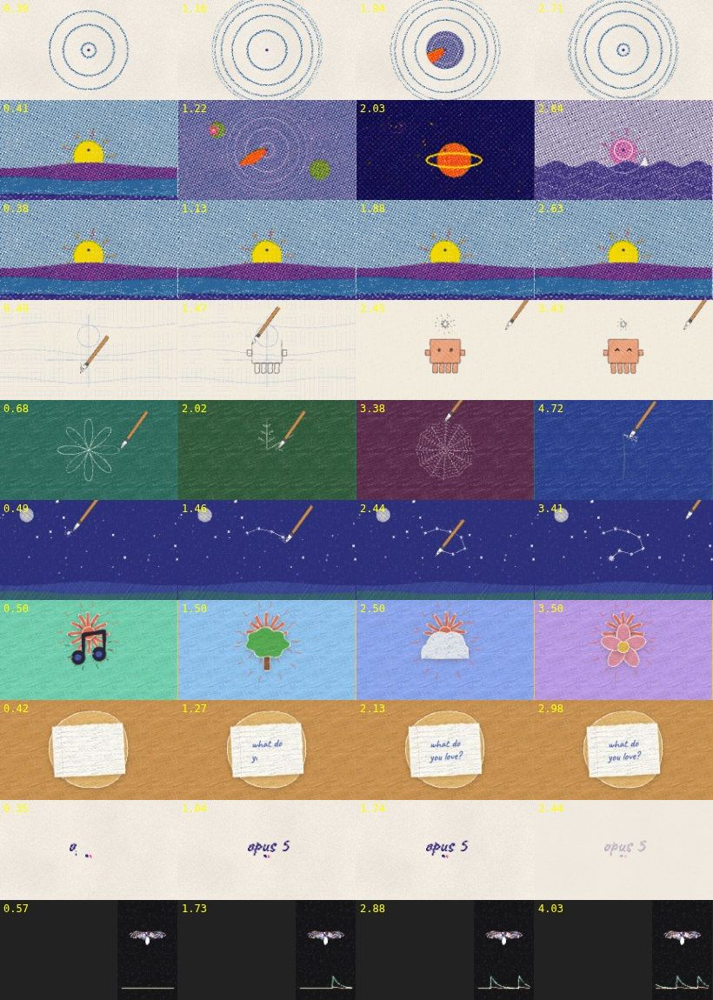

# Drawn styles: the hand-made motion library

Bhippi can make films that look made by hand and printed:
- risograph worlds;
- a pen that draws the world in crayon;
- cut-paper collage on twos;
- a sketchbook of generative line drawings;
- a neural scope panel.

Any AI (or a person) uses the same library, which has three parts:
- a **`drawing` layer**, written as data;
- **ten templates** that make whole beats in one call;
- a **playbook** of measured timing and rules.

The plan, and the frame-by-frame study of the five reference films it was built from, are in
[DRAWN-STYLES-PLAN.md](DRAWN-STYLES-PLAN.md).



Rows, top to bottom: `riso-ripple-open`, `riso-montage`, `riso-world`, `pen-draws`, `sketchbook`,
`constellation`, `paper-words`, `paper-note`, `hand-title`, `scope-panel`.

## How an AI uses it

1. `motion_guide {topic:"hand-made"}` gives the beat recipe, the look, the measured timing and the
   rules.
2. `list_drawn_styles` gives the whole catalogue as data:
   - looks and ink sets;
   - every item kind with its params;
   - faces, pen tools, worlds;
   - effects, templates and transitions;
   - a complete example layer.
3. Build it in one of three ways:
   - **A template:** `create_motion_scene {template:"pen-draws", params:{subject:"bot", title:"hello"}}`.
   - **Your own layer:** a raw scene with a `{type:"drawing", drawing:{…}}` layer.
   - **A mix:** a template, then `update_motion_scene` patches to its items.
4. Join beats with `create_motion_sequence`, using the `paper-tear` transition or `iris` (with `at` set
   to the dot).
5. Print footage or logos into the same world with the `riso` or `halftone` effect.

## The `drawing` layer (`src/motion/ink/`)

```jsonc
{ "id": "page", "type": "drawing", "drawing": {
  "look": "crayon",          // riso | crayon | ink | pencil | cut-paper | felt | flat | scope
  "inks": ["#2f6fb0", "#ff48b0", "#ffe800"],   // riso plates (1–4) / palette
  "paper": "#f2ecdf",        // omit = transparent over what is below
  "step": 2,                 // on twos at 24 fps
  "boil": 1.1,               // px of line wobble, redrawn every drawing
  "items": [
    { "kind": "construction", "opacity": { "k": [{ "t": 0, "v": 100 }, { "t": 2, "v": 0 }] } },
    { "id": "hero", "kind": "bot", "at": [960, 600], "size": 480,
      "draw":   { "k": [{ "t": 0.2, "v": 0 }, { "t": 1.8, "v": 1 }] },
      "fillIn": { "k": [{ "t": 1.8, "v": 0 }, { "t": 2.1, "v": 1 }] },
      "faces": [{ "t": 0, "face": "closed" }, { "t": 2.5, "face": "happy" }] },
    { "kind": "sparkle", "at": [960, 290], "size": 130, "pop": 2.4 },
    { "kind": "write", "text": "hello", "at": [960, 930], "fontSize": 110, "from": 2.6 },
    { "kind": "pen", "tool": "nib", "follow": ["hero"], "rest": [1500, 300] }
  ] } }
```

- **Items:**
  - **Primitives:** circle, ellipse, rect, polygon, star, line, path (SVG `d`), blob, icon (any
    Lucide icon, inked in the look).
  - **Motifs:** ripples, rose, spiral (nautilus), snowflake, web, lissajous, dandelion, sparkle,
    burst, constellation, stars, waves, hills, sun, moon, cloud, flower, tree, grass, rain,
    planet, heart, trail.
  - **Characters:** `bot` (the cube creature) and `sprite` (the sun mascot), with `faces`: dots,
    happy, squint, closed, dizzy, wide, smile, surprised, sleepy.
  - **Paper and type:** `write` (hand lettering that writes on at `cps`) and `note` (lined paper).
  - **Tools:** `pen` (nib, pencil, brush, crayon), `construction`, `tear`.
  - **Scope:** `trace`, `cloud-points`.
  - **Grouping:** `group`.
- **Placement:** `at` (centre), `size`, `rotation`, `scale` (a number, or [sx, sy] for squash),
  `opacity`, `in`/`out`. Any of them can be keyed or an expression.
- **Motion verbs:**
  - `draw` 0→1: the outline draws on, and the pen rides the tip;
  - `fillIn` 0→1: the fill sweeps on, as hatching in crayon;
  - `pop`: a time; the item shows 2 drawings big with burst ticks, 1 drawing slightly big, then
    rests;
  - `wobble`: extra boil for this item;
  - a face switches when its `faces` key comes up.
- **Riso:** each item's colour is separated into the inks by a multiply-model solve. `ink` forces a
  plate or a coverage list. Items knock out what is under them unless `overprint: true`.
- **Determinism:** every frame is a function of the data, the seed and the drawing clock, so the
  preview, a scrub and the export are the same frame.

### How it renders

- **Each frame:**
  - `drawingClock` holds the time on twos;
  - `placeItems` evaluates placement, pops and boil (`wobble` re-seeded per drawing) and draw-on;
  - `penPosition` puts the pen on the current tip, or glides it between strokes and to rest.
- **Painting:** `drawDrawing` paints with Canvas2D:
  - **crayon:** hatch bundles over a wash;
  - **ink:** pressure ribbons;
  - **pencil:** several faint passes;
  - **cut paper:** a torn rim, felt streaks and print textures;
  - **scope:** additive glow.
- **Riso:** coverage is drawn into one canvas per ink. The GPU pass `RISO_PLATES_FS`:
  - screens each plate into an amplitude-modulated halftone at its own angle, pinned to the
    layer;
  - adds mottling and starved-ink flecks;
  - offsets each plate by its misregistration (with a per-drawing tremor);
  - multiplies onto grained paper.

  The pen is laid over the print in colour.
- **Effects:** `riso` and `halftone` (`RISO_EFFECT_FS`) print any layer:
  - the ink coverage is solved per pixel from its colour;
  - odd plates read the picture at their misregistered offset, so the edges fringe.

## Templates (`src/motion/kit/drawnTemplates.ts`)

| id | from | does |
|---|---|---|
| `riso-world` | Film 1 | one full-frame riso vignette (sunrise, night, pond, bloom, sea, garden, cosmos, lighthouse, orbit), with your own items on top |
| `riso-ripple-open` | Film 1 | rings every 4 f out of a dot; a world opens out of it in 4 f and closes in 3 f (or opens to full frame) |
| `riso-montage` | Film 1 | worlds under a fixed dot at 12 → 6 → 3 f, then re-inked (palette swap) with a pulse ring |
| `pen-draws` | Film 4 | construction lines, the nib outlines the subject, crayon hatch fill, eyes, a sparkle pop, a hand-written title |
| `sketchbook` | Film 4 | generative motifs drawn by the nib, one per felt page |
| `constellation` | Film 4 | the nib joins stars; each flashes when reached |
| `paper-words` | Film 5 | a cut-paper card per beat: the object and the mascot pop, the word writes itself |
| `paper-note` | Film 5 | lined note paper pops, a question writes itself on |
| `hand-title` | Films 1, 4 | the name writes on at 2 f a letter over two dots, holds, fades in 4 f |
| `scope-panel` | Film 3 | a dark panel beside footage: a point-cloud brain that flares on the spikes, and traces |

Riso ink sets (`src/motion/ink/library.ts`): classic, sunset, sea, duotone, mono, forest.

## Transitions

- **`paper-tear`:** a torn edge sweeps across in 6 f and reveals the next beat. A white torn rim
  with a shadow rides the edge.
- **`iris`** with `at` on the dot: the next world opens out of it.

## Working with the Character Studio

The rigged 2.5D characters (the Character Studio, `docs/CHARACTER-STUDIO-PLAN.md` on its branch)
share this library's hand-made primitives, in `src/motion/ink/core.ts`:
- `drawingClock` for ones, twos and threes;
- `wobble` for boil per drawing;
- `ribbon` for brush-width lines.

A character standing in a drawn world should honour the drawing's `look`, `step` and `boil`, so it
reads as the same medium. The `bot` and `sprite` items are one-line mascots, not a second rig.

## Checking

- **Unit tests:** `tests/motionInk.test.ts` covers:
  - the clock, trimming, boil and ink separation;
  - that every item kind draws;
  - write-on and faces;
  - pops, pen tracking and determinism;
  - that every look paints;
  - validation messages;
  - that the catalogue is consistent;
  - every template at landscape and portrait;
  - the paper-tear sequence.

  `tests/motionDirection.test.ts` checks the `hand-made` playbook.
- **Motion Lab:**
  - `lab.tpl(name, templateId, params, w, h)` builds any template;
  - `lab.put(name, scene)` loads any scene JSON;
  - `lab.sheet(name, times)` renders a contact sheet;
  - the `drawn-tear` and `drawn-riso-fx` scenes cover the transition and the effects.

## Limits

- **Hands:** the hands holding the note paper in Film 5 are not drawn. Use the note alone or a
  cut-out photo.
- **Cube creatures:** Film 2's stop-motion cubes are 2D here (the `bot` on twos). For a real 3D set
  use `render_3d_scene`.
- **Riso layer cost:** a riso layer draws one canvas per ink on the CPU per frame. About 20–60 ms at
  1080p, so the preview may drop frames with many riso layers; the export is exact.
