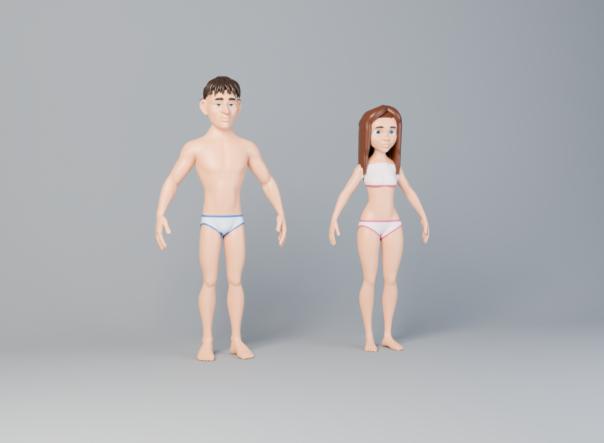
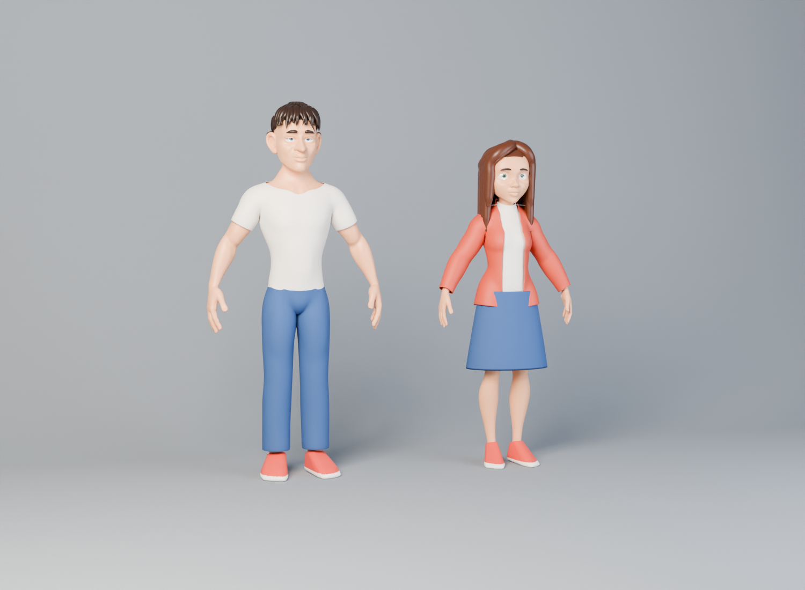

# Sculpted 3D characters

Two rigged base characters, one male and one female, built in Blender and driven in the browser by the ToonKit move library.




## What is here

| Path | What it is |
| --- | --- |
| `blender/` | Headless Blender pipeline that builds, rigs, dresses and exports both characters. |
| `studio/male.glb`, `studio/female.glb` | Exported characters: skinned, 51 bones, Draco-compressed, about 0.8 MB each with the whole wardrobe. |
| `studio/rig3d.js` | Runtime that loads the `.glb` files, applies a CharacterSpec and turns a ToonKit pose into bone rotations. |
| `studio/toonkit.js` | Move, camera, prop and FX library, plus the Director and the AI tool schemas. It picks Rig3D when the sculpted characters are loaded. |
| `studio/toon3d.js` | The earlier procedural toon builder, kept as a fallback (`spec.engine: "toon"`). |
| `studio/studio.src.html`, `studio/build.py` | Character Studio 3D page source and its single-file build. |
| `renders/` | Cycles renders and Studio screenshots. |

## How the characters are made

1. **Base mesh.** The start is Blender's free CC0 *Human Base Meshes* bundle (stylized male and female bodies, clean quad topology, same vertex count). It is not committed; download `human-base-meshes-bundle-v1.4.1.zip` from blender.org/download/demo-files.
2. **Stylize** (`stylize.py`, `brush.py`). Scripted sculpt brushes (grab, scale, inflate, smooth and an eyelid-droop brush) push the bases toward the reference style: long hanging nose, heavy sleepy lids, longer neck, heavier brow ridge.
3. **Hair and brows** (`hair.py`). Tapered bezier clumps are laid over the scalp by a flow field, on top of a scalp cap. The male has a messy short cut; the female has long side-parted hair.
4. **Eyes** (`eyes.py`). Planar UVs and a painted iris texture, so the iris survives skinning and glTF export.
5. **Rig** (`rig.py`). Joints are found from the mesh itself: horizontal slices of a dense surface sample separate the arms from the torso, and 1-D k-means on the hand finds the fingers. Blender's automatic weights then bind the skin.
6. **Wardrobe** (`wardrobe.py`, `garment.py`). Garments are cut from the bound body by bone weights and plane cuts, lifted along normals, draped with smoothing and an outside-only shrinkwrap, and given a minimum distance from each bone for a loose fit. Items: T-shirt, long sleeve, hoodie, open jacket, straight jeans, shorts, skirt and sneakers (a convex hull around the foot with a white sole), plus underwear. Weights are transferred from the body.
7. **Export**. Armature modifiers go first in each stack, the body is exported without subdivision (normals stay smooth), and meshes are Draco-compressed.

Rebuild everything (Blender 4.2 LTS):

```sh
blender -b human_base_meshes_bundle.blend -P blender/make_cast.py -- out/cast export 8
```

Other modes: `head`, `body`, `hero` (Cycles presentation shots) and `pose` (rig test). Garments to show in `hero` renders are chosen with `wear_m=tshirt+jeans+sneakers` and `wear_f=...`.

## Using them from the app or an AI

A character is the same CharacterSpec used by the 2D Character room. Rig3D maps it onto the sculpted bases:

- `body` chooses the base: `fem` gives the female base, anything else the male.
- `age` and `shape` scale the rig.
- `skin`, `hair.color` and `face.eyeColor` recolour the materials.
- `top.kind`, `outer`, `bottom.kind` and `shoes` choose which wardrobe pieces show, and set their colours.

Shots are unchanged JSON (`actors`, `beats`, `camera`, `props`, `fx`) built only from library names. That is what the AI tools `list_toon_library`, `create_character3d`, `direct_shot`, `preview_shot` and `export_shot` produce. Poses are solved with two-bone IK and proper bend planes for arms and legs, curl axes for all fingers, and gaze and blink on the eyes.

For the published page the `.glb` files are converted to embedded glTF JSON (`glb2json.py`), because the artifact host does not serve `.glb`. Draco decoding uses three.js's pure-JS decoder, shipped next to the page.
